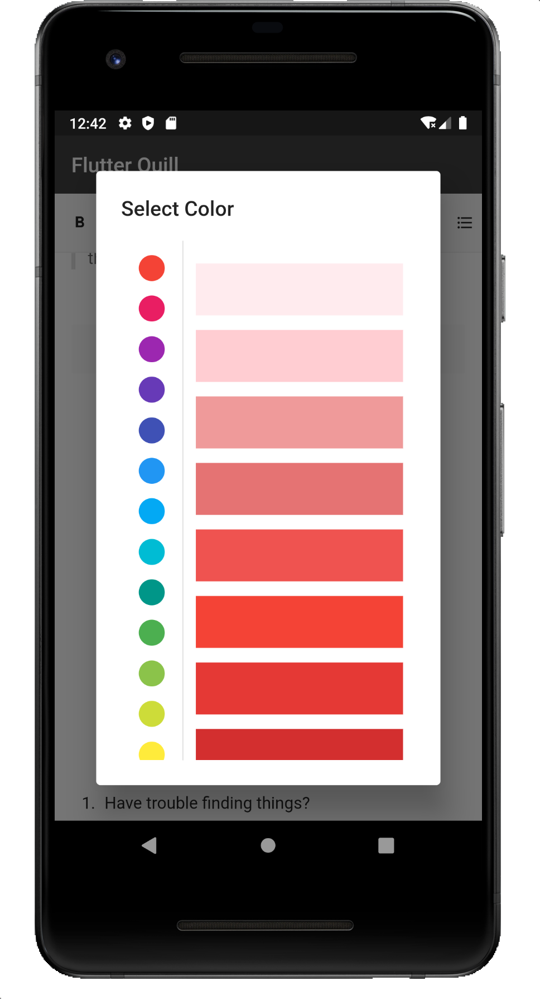

# Flutter Quill

<p align="center" style="background-color:#282C34">
  
</p>
<h1 align="center">A rich text editor for Flutter</h1>

[![MIT License][license-badge]][license-link]
[![PRs Welcome][prs-badge]][prs-link]
[![Watch on GitHub][github-watch-badge]][github-watch-link]
[![Star on GitHub][github-star-badge]][github-star-link]
[![Watch on GitHub][github-forks-badge]][github-forks-link]

[license-badge]: https://img.shields.io/github/license/singerdmx/flutter-quill.svg?style=for-the-badge
[license-link]: ./LICENSE
[prs-badge]: https://img.shields.io/badge/PRs-welcome-brightgreen.svg?style=for-the-badge
[prs-link]: https://github.com/singerdmx/flutter-quill/issues
[github-watch-badge]: https://img.shields.io/github/watchers/singerdmx/flutter-quill.svg?style=for-the-badge&logo=github&logoColor=ffffff
[github-watch-link]: https://github.com/singerdmx/flutter-quill/watchers
[github-star-badge]: https://img.shields.io/github/stars/singerdmx/flutter-quill.svg?style=for-the-badge&logo=github&logoColor=ffffff
[github-star-link]: https://github.com/singerdmx/flutter-quill/stargazers
[github-forks-badge]: https://img.shields.io/github/forks/singerdmx/flutter-quill.svg?style=for-the-badge&logo=github&logoColor=ffffff
[github-forks-link]: https://github.com/singerdmx/flutter-quill/network/members

---

FlutterQuill is a rich text editor and a [Quill] component for [Flutter].

This library is a WYSIWYG (What You See Is What You Get) editor built for the modern Android, iOS, web and desktop platforms. Check out our [Youtube Playlist] or [Code Introduction](./doc/code_introduction.md) to take a detailed walkthrough of the code base. You can join our [Slack Group] for discussion.

Pub: [FlutterQuill] <br>
If you are viewing this page from pub.dev page then you might have some issues with opening some of the links, please open it in GitHub repo instead.

## Table of contents
- [Flutter Quill](#flutter-quill)
  - [Table of contents](#table-of-contents)
  - [Screenshots](#screenshots)
  - [Installation](#installation)
  - [Usage](#usage)
  - [Migration](#migration)
  - [Input / Output](#input--output)
  - [Configurations](#configurations)
    - [Links](#links)
    - [Font Family](#font-family)
  - [Embed Blocks](#embed-blocks)
    - [Using the embed blocks from `flutter_quill_extensions`](#using-the-embed-blocks-from-flutter_quill_extensions)
    - [Custom Embed Blocks](#custom-embed-blocks)
    - [Custom Toolbar](#custom-toolbar)
    - [Translation](#translation)
  - [Conversion to HTML](#conversion-to-html)
  - [Testing](#testing)
  - [Contributors](#contributors)

## Screenshots

<details>
<summary>Tap to show/hide screenshots</summary>

<br>




</details>

## Installation

```yaml
dependencies:
  flutter_quill: ^<latest-version-here>
```

<p align="center">OR</p>

```yaml
dependencies:
  flutter_quill:
    git: https://github.com/singerdmx/flutter-quill.git
```


>
> Note: At this time, we are making too many changes to the library and you might see new version almost every day
>
> Using the latest version and reporting any issues you encounter on GitHub will greatly contribute to the improvement of the library. Your input and insights are valuable in shaping a stable and reliable version for all our users. Thank you for being part of the open-source community!
>
> If the latest version of [FlutterQuill Extensions] is pre-release, then please use it in order to work with the latest stable version of [FlutterQuill]
>

Compatible versions:

| flutter_quill           | flutter_quill_extensions | flutter_quill_test      |
|-------------------------|--------------------------|-------------------------|
| 8.5.2                   | 0.6.9                    | 0.0.5                   |
| 8.5.1                   | 0.6.7                    | 0.0.5                   |
| 8.5.0                   | 0.6.7                    | 0.0.5                   |

Theses versions are tested and well supported, you shouldn't get a build failure

## Usage

See the `example` directory for a minimal example of how to use FlutterQuill.  You typically just need to instantiate a controller:

```dart
QuillController _controller = QuillController.basic();
```

and then embed the toolbar and the editor, within your app.  For example:

```dart
QuillProvider(
  configurations: QuillConfigurations(
    controller: _controller,
    sharedConfigurations: const QuillSharedConfigurations(
      locale: Locale('de'),
    ),
  ),
  child: Column(
    children: [
      const QuillToolbar(),
      Expanded(
        child: QuillEditor.basic(
          configurations: const QuillEditorConfigurations(
            readOnly: false,
          ),
        ),
      )
    ],
  ),
)
```

And depending on your use case, you might want to dispose the `_controller` in dispose mehtod

Check out [Sample Page] for more advanced usage.

## Migration
We have recently add [migration guide](/doc/migration.md) for migration from different versions

## Input / Output

This library uses [Quill] as an internal data format.

* Use `_controller.document.toDelta()` to extract the deltas.
* Use `_controller.document.toPlainText()` to extract plain text.

FlutterQuill provides some JSON serialization support, so that you can save and open documents.  To save a document as JSON, do something like the following:

```dart
var json = jsonEncode(_controller.document.toDelta().toJson());
```

You can then write this to storage.

To open a FlutterQuill editor with an existing JSON representation that you've previously stored, you can do something like this:

```dart
var myJSON = jsonDecode(r'{"insert":"hello\n"}');
_controller = QuillController(
          document: Document.fromJson(myJSON),
          selection: TextSelection.collapsed(offset: 0),
        );
```

## Configurations

The `QuillToolbar` and `QuillEditor` widgets lets you customize a lot of things
[Sample Page] provides sample code for advanced usage and configuration.

### Links
- [Using Custom App Widget](./doc/configurations/using_custom_app_widget.md)
- [Localizations Setup](./doc/configurations/localizations_setup.md)
- [Font Size](./doc/configurations/font_size.md)
- [Font Family](#font-family)
- [Custom Toolbar buttons](./doc/configurations/custom_buttons.md)

### Font Family

To use your own fonts, update your [assets folder](./example/assets/fonts) and pass in `fontFamilyValues`. More details at [this commit](https://github.com/singerdmx/flutter-quill/commit/71d06f6b7be1b7b6dba2ea48e09fed0d7ff8bbaa), [this article](https://stackoverflow.com/questions/55075834/fontfamily-property-not-working-properly-in-flutter) and [this](https://www.flutterbeads.com/change-font-family-flutter/).

## Embed Blocks

As of version 6.0, embed blocks are not provided by default as part of this package. Instead, this package provides an interface to all the user to provide there own implementations for embed blocks. Implementations for image, video and formula embed blocks is proved in a separate package [`flutter_quill_extensions`](https://pub.dev/packages/flutter_quill_extensions).

Provide a list of embed

### Using the embed blocks from `flutter_quill_extensions`

To see how to use the extensions package, please take a look at the [README](./flutter_quill_extensions/README.md) of [FlutterQuill Extensions]

### Custom Embed Blocks

Sometimes you want to add some custom content inside your text, custom widgets inside of them. An example is adding notes to the text, or anything custom that you want to add in your text editor.

Open this [page](./doc/custom_embed_blocks.md) for more info


### Custom Toolbar
If you want to use custom toolbar but still want the support of this libray

Open this [page](./doc/custom_toolbar.md) for more info

### Translation

The package offers translations for the quill toolbar and editor, it will follow the system locale unless you set your own locale.

Open this [page](./doc/translation.md) for more info

## Conversion to HTML

Having your document stored in Quill Delta format is sometimes not enough. Often you'll need to convert
it to other formats such as HTML in order to publish it, or send an email.

You have two options:

1. Using [quill_html_converter](./packages/quill_html_converter/) to convert to/from HTML, the package can convert the Quill delta to HTML well (it uses [vsc_quill_delta_to_html](https://pub.dev/packages/vsc_quill_delta_to_html)) but the converting from HTML back to Quill delta is experimental
2. Another option is to use
[vsc_quill_delta_to_html](https://pub.dev/packages/vsc_quill_delta_to_html) to convert your document
to HTML. This package has full support for all Quill operations - including images, videos, formulas,
tables, and mentions. Conversion can be performed in vanilla Dart (i.e., server-side or CLI) or in Flutter.
It is a complete Dart part of the popular and mature [quill-delta-to-html](https://www.npmjs.com/package/quill-delta-to-html)
Typescript/Javascript package. this package doesn't convert the HTML back to Quill Delta as far as we know

## Testing

Please use [flutter_quill_test](https://pub.dev/packages/flutter_quill_test) for testing

## Contributors

Special thanks for everyone that have contributed to this project...

<a href="https://github.com/singerdmx/flutter-quill/graphs/contributors">
  
</a>

<br>

Made with [contrib.rocks](https://contrib.rocks).

We welcome contributions!

Please follow these guidelines when contributing to the project. See [CONTRIBUTING.md](./CONTRIBUTING.md) for more details. <br>

We must mention that the `CONTRIBUTING.md` have a development notes, so if you planning on contribtuing to the repo, please read it.

You can check the [Todo](./doc/todo.md) list if you want to

[Quill]: https://quilljs.com/docs/formats
[Flutter]: https://github.com/flutter/flutter
[FlutterQuill]: https://pub.dev/packages/flutter_quill
[FlutterQuill Extensions]: https://pub.dev/packages/flutter_quill_extensions
[ReactQuill]: https://github.com/zenoamaro/react-quill
[Youtube Playlist]: https://youtube.com/playlist?list=PLbhaS_83B97vONkOAWGJrSXWX58et9zZ2
[Slack Group]: https://join.slack.com/t/bulletjournal1024/shared_invite/zt-fys7t9hi-ITVU5PGDen1rNRyCjdcQ2g
[Sample Page]: ./example/lib/pages/home_page.dart
[FluentUI]: https://pub.dev/packages/fluent_ui

