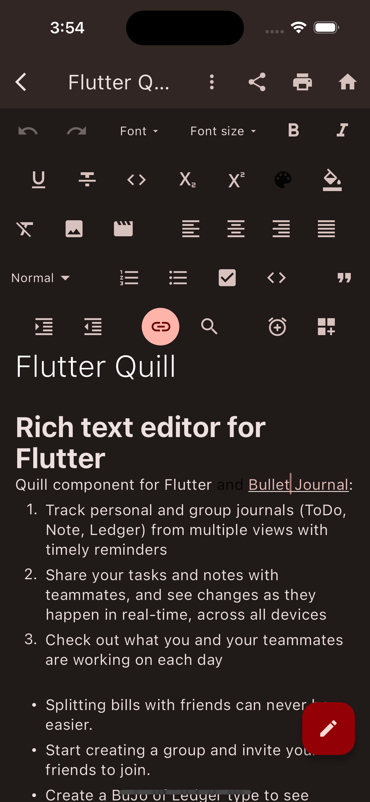
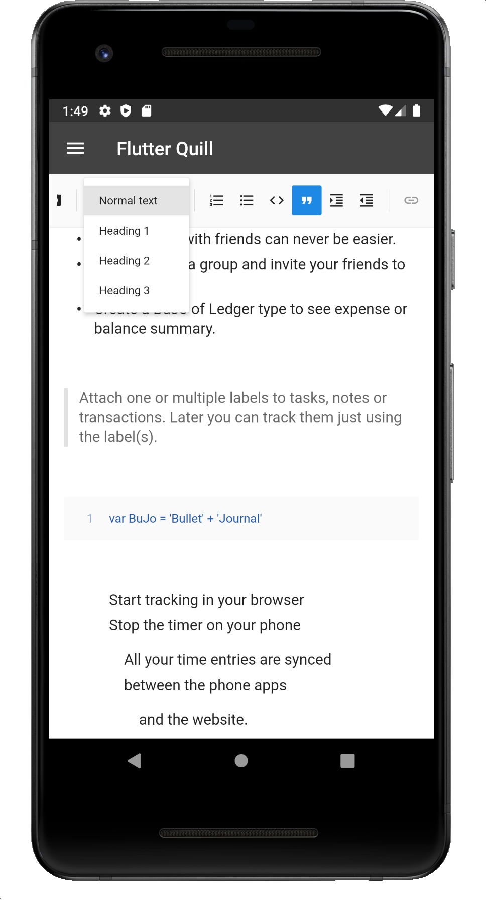
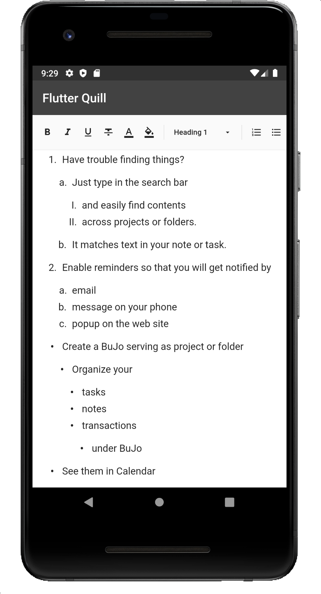
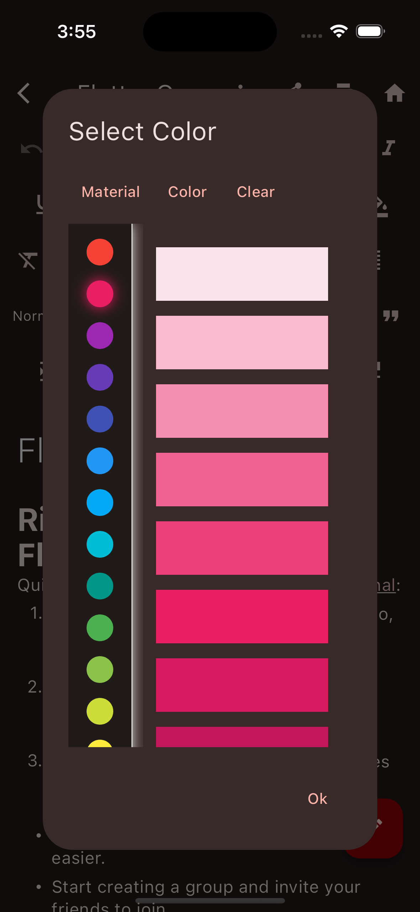

# Demo

This is just a demo of Flutter Quill


## Screenshots






## Development notes

- When changing the `assets` please run:
```
dart run build_runner build --delete-conflicting-outputs
```